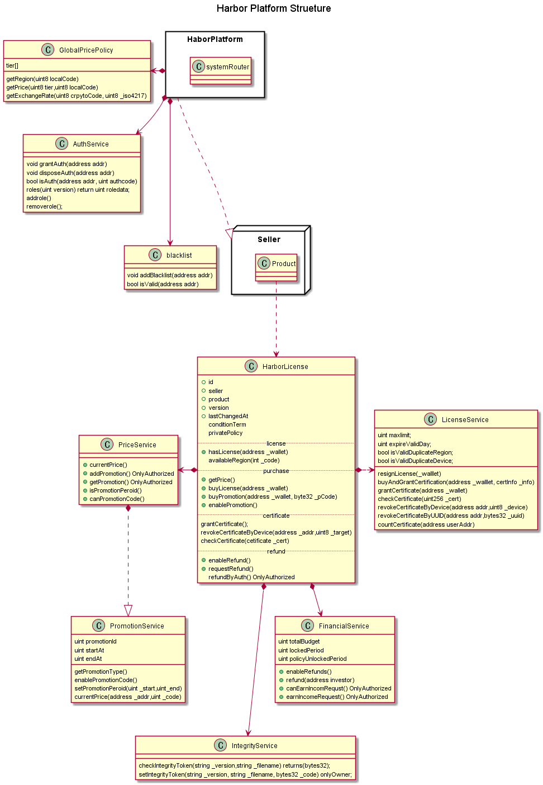
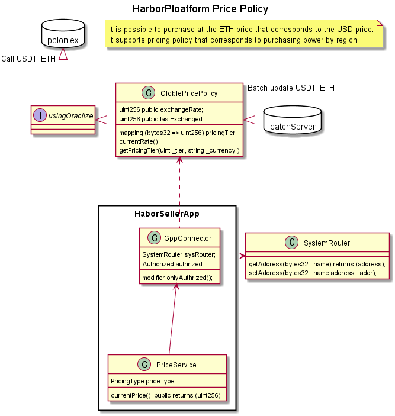
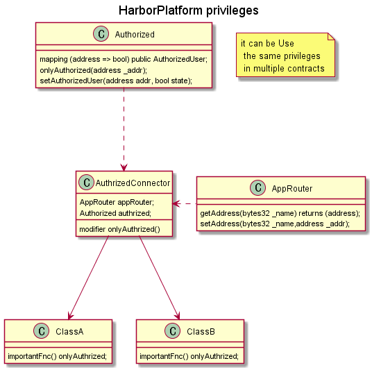
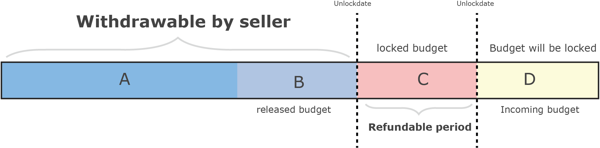

# HarborPlatformContractDemo
Harbor platform prototype contract, it is designed to verify and test the capabilities of the port platform.

## About HarborPlatform

Technically, Harbor platform provides a library that allows software licenses to be securely managed using a blockchain network and to facilitate in-app billing using cryptocurrency.
Furthermore, we aim to build cross-platform support, easy software sales and a simple in-app payment system.
As a retailing channel for software sales, we provide a Harbor Store and support various applications using blockchain technology.

#### Harbor Whitepaper :link

#### Harbor Token Whitepaper :link

#### Video (https://www.youtube.com/watch?v=qTYIwlzJfRs)

#### www.toharbor.com

## ColorMate

ColorMate is a program that finds an appropriate color set for a given color.
This is a program provided for testing and verification of Harbor platform, but it is not only a project for testing but also a project for independent improvement.
It has limited functionality as a client program and can be tuned off through purchase. In-App support for Wallet account creation, purchasing, certificate issuance and verification, and product integrity verification.

[manual](https://medium.com/@junghan.kim/harbor-platform-prototype-296ea429d513){:target="_blank"}

# Download : mac link / [window-64Bit](https://github.com/harborPlatform/HarborPlatformContractDemo/raw/master/release/win64/Setup.zip)
 
 
## Harbor Platform Contract Structure

## Major technical challenges
- Certificate (*License issuance and verification*)
- Pricing Policy and Purchase at ETH price corresponding to USD price
- Global Privilege Policy
- Refund process that allows the seller to withdraw money

### Certificate

License certificate verification

Generally, security has two meanings: first, it prevents data from being manipulated; second, it protects sensitive information from exposure.
Blockchain technology is known to excel in security Therefore, it is easy to think that the data stored in the blockchain is safe.

Basically, blockchain technology is designed to make data manipulation impossible.
but, it is not designed to protect information from being exposed to the outside world. Rather, the services provided through SmartContract are open to everyone and can be verified to ensure trust.

In smart contract development, solidity has exposure modifiers such as private or public, but it is not designed for complete security of the data (*All information is shared by the nodes and may be exposed by private data declared through reversing*)

We considered two ways to securely store license information in a blockchain.
1. Storing Encrypted Data
Encrypted data storage is not easy to implement because blocks do not support encryption, decryption, and verification in the block.

2. Certificate-based data storage (*PKI*)
Certificate-based data uses the existing Ethernet wallet addressing scheme. It can be issued with a certificate (*private key, public key*) and can be verified in a blockchain (*ecrecover*) with a digital signature.

")

### Pricing Policy and Purchase at ETH price corresponding to USD price
Harbor platform allows you to sell products at the dollar price and pay with the appropriate ether.(*Harbor token is supported after crowdsale*)
And we support you to set sales prices considering the purchasing power of each region.

- Purchase Process 

")

- Pricing Process

### Global Privilege Policy
Harbor platform allows one authorization policy contract to be used in multiple smart contracts.
following approach allows multiple smart contracts (*features*) to be maintained independently while keeping the entire contract structure simple.

### Refund process that allows the seller to withdraw money
It takes complex logic to handle the sale and refund of the product and the seller to withdraw their proceeds.
Harbor platform offers refunds to buyers and safe withdrawals to sellers.

